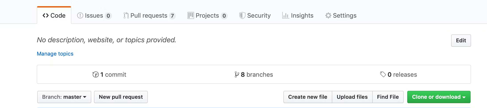
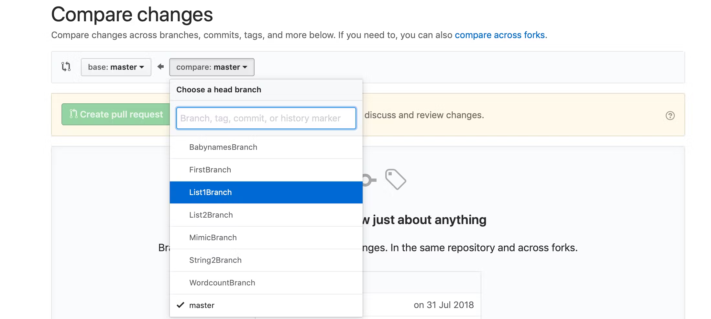

# Creating a Pull Request 

The general process is as follows:

* A developer creates the feature in a dedicated branch in their local repo.
* The developer pushes the branch to the central repository(origin).
* The developer files a pull request via GitHub/Bitbucket.
* The rest of the team reviews the code, discusses it, and alters it.
* The project maintainer merges the feature into the official repository and closes the pull request.

If you are new to git, [this video](https://www.youtube.com/watch?v=JOIL6gof2BA) is an excellent starting point for you to familiarize yourself with the basics of git.
It’s highly encouraged that you follow along with the examples, and do them yourself.
You only learn git by using it yourself, not by watching someone else use it.

If you are already familiar with git, we also have a short [video](https://youtu.be/8P2ieE_RdyM) that explains these ideas, that we recommend watching.

## Feature branch

Instead of working directly on master branch, we create a new branch off master every time we start working on a new feature or fix an issue. 
Feature branches should have descriptive names, like animated-menu-items or issue-#1061, and the branch name should always begin with the author’s name for example `gopal/animated-menu-items`. 
The idea is to give a clear, highly focused purpose to each branch.

### Create a new branch

```shell
$ git checkout -b [branch_name]
```

This creates and checks out the new branch based on the last commit of your current branch.

## Push feature branch to remote

Once you are done working on the feature, stage and commit your changes.

```shell
$ git status
$ git add <files>
$ git commit
```

The changes you make in your new branch will stay in your local repository, Push the feature branch up to the central repository(origin).

```shell
$ git push origin [branch_name]
```

This command pushes new-feature to the central repository (origin).

## Create a Pull Request/Merge Request

To get feedback on the new feature branch, create a pull request from the GitHub/Bitbucket asking to merge their additions into master.
This allows the team members to review your changes and give feedback before they become a part of the main codebase.

Go to the git repository in web. Click on `New pull request`



Select the branch you want to create PR for



and click on the Create pull request button.

## Addressing the feedback

Make the suggested changes and add a new commit to the branch used in the pull request and push the branch to GitHub. The pull request will automatically be updated with the additional commit.

You can use the `git commit --amend` command to modify the most recent commit. It lets you combine staged changes with the previous commit instead of creating an entirely new commit. It can also be used to simply edit the previous commit message without changing its snapshot.

While addressing the feedback, make sure it is for the relevant commit rather than the latest one. You can use git rebase -i to make a list of the commits which are about to be rebased. It lets the user edit that list before rebasing. This mode can also be used to split commits.

There is a very good to GIT interface available for macOS [GitUp](https://gitup.co) which makes these steps easier.

### Changing commit message

Let’s say you just committed with a wrong commit message. You can edit the previous commit’s message without altering its snapshot:

```shell
$ git commit --amend -m "an updated commit message"
```

The -m option allows you to add the updated commit message.

### Changing committed files

Let’s say we’ve edited a few files that we would like to commit in a single snapshot, but we forget to add one of the files the first time around. Fixing the mistake is simply a matter of staging the other file and committing with the —amend flag:

```shell
$ git commit --amend --no-edit
```

The `--no-edit` flag will allow you to make the amendment to your commit without changing its commit message.

### Don’t amend public commits

Avoid amending a commit that other developers have based their work on. Amending a commit creates entirely new commit and the previous commit will no longer be on your current branch and would make it difficult for others to recover the branch.

## Force push

Git prevents you from overwriting the central repository’s history if the remote history has diverged from your history.
The `--force` flag overrides this behavior and makes the remote repository’s branch match your local.
You should force push only when you have made changes to your commit with a git commit `--amend` or `git rebase`.

```shell
$ git push -f origin "branch-name"
#OR
$ git push --force origin "branch-name"
```

**You should only ever force push branches that you own, and are not intended for others to work off-of.
That means, never force push master, develop, any release branches, etc.**

## Get your PR/MR merged

Once your updated PR is approved and conflict-free, the maintainer of the repository will merge your code to the master branch.

# Exercise

Based on what you have learned from the above documentation, create a new file in this folder called `ABOUT_ME.md`, 
and add some introductory information about yourself, formatted using proper markdown etiquettes. Then you have to get it
reviewed and merged by your mentor.

- Estimated time: 1 hour
